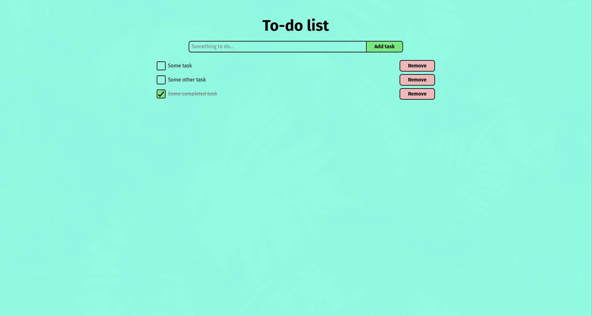

# To-do list

This is a basic to-do list app. I have created it to learn Figma and Svelte.



## Usage (through `npm`)

First, install the dependencies:

```shell
npm ci
```

Then, build the application and serve it:

```shell
npm run build
serve dist # You can install "serve" using "npm install -g serve"
```

If you want to start the development server, you can run:

```shell
npm run dev
```

## License

The code is licensed under the MIT License.
